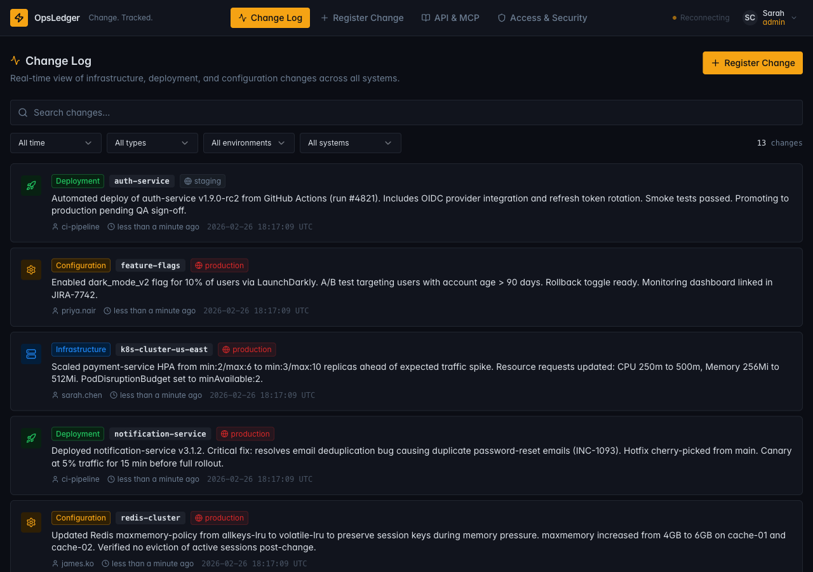
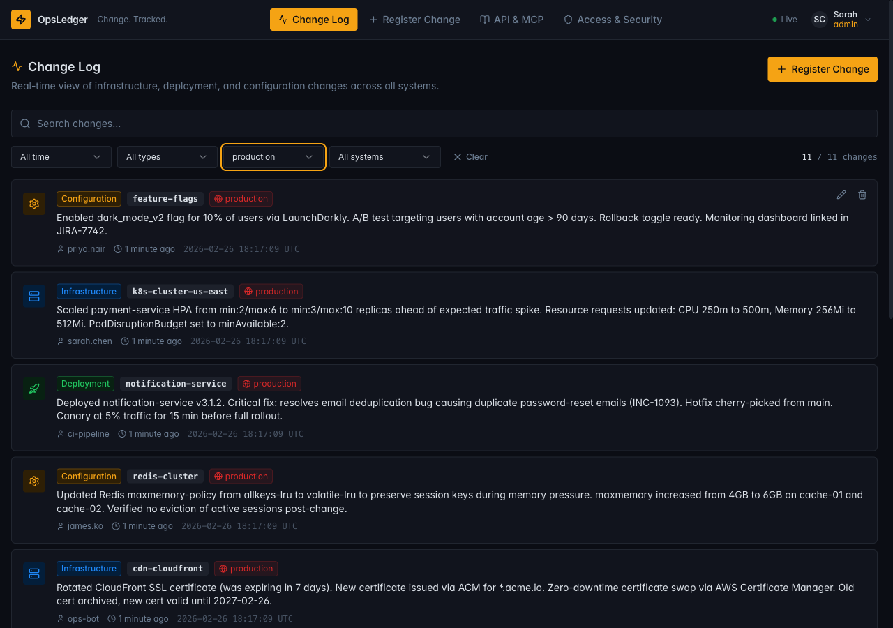
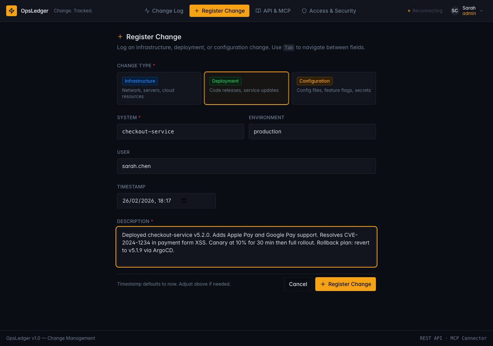
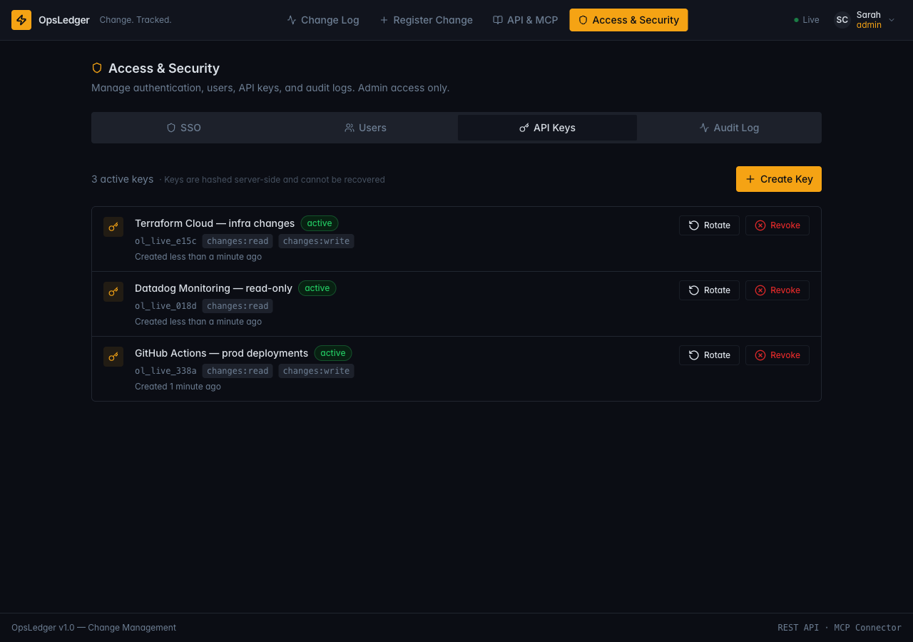

# OpsLedger

A centralized change logging system for tracking infrastructure, deployment, and configuration changes across your organization's systems.



## Overview

OpsLedger provides a single source of truth for all changes made to your infrastructure. Whether you're deploying new services, updating configurations, or modifying network settings, this platform helps teams maintain visibility and accountability over their entire change history.

## Screenshots

| Change Log | Filter by Environment |
|---|---|
|  |  |

| Register Change | API Key Management |
|---|---|
|  |  |

## Features

### Real-time Updates
The change log updates live across all open browser sessions without any page refresh — powered by **Server-Sent Events (SSE)**:
- **Instant propagation** — when any user registers, edits, or deletes a change, every connected client sees the update immediately
- **Connection status indicator** — a green pulsing dot in the nav bar shows the live connection; turns amber with "Reconnecting" if the stream drops
- **Exponential backoff reconnection** — the client automatically reconnects with 1s → 2s → 4s … capped at 30s backoff
- **Smart fallback** — when the SSE stream is offline, the UI falls back to a manual refetch after mutations so data stays consistent
- **JWT-authenticated stream** — the `/api/events` endpoint validates the session token; API keys are intentionally not accepted on the SSE endpoint to avoid long-lived credentials appearing in server logs

### Change Management
- **Register Changes** - Log infrastructure, deployment, and configuration changes with rich metadata including system, environment, change type, and detailed descriptions
- **Real-time Filtering** - Filter changes by system, environment, user, change type, and time range
- **Search & Autocomplete** - Quickly find changes with full-text search and intelligent autocomplete for systems, environments, and users

### Authentication & Authorization
- **Role-Based Access Control** - Three roles with distinct permissions:
  - `Viewer` - Read-only access to the change log
  - `Editor` - Can register new changes
  - `Admin` - Full access including user and API key management
- **JWT Session Authentication** - Secure email/password authentication with token-based sessions

### API Key System
- **Programmatic Access** - Create API keys for CI/CD pipelines and external tools
- **Scoped Permissions** - Define key permissions with scopes like `changes:read` and `changes:write`
- **Key Rotation** - Easily rotate and revoke API keys
- **Usage Tracking** - Monitor when keys were last used

### Admin Panel
- User management (create, edit, delete users)
- API key lifecycle management
- Audit log for security tracking

## Tech Stack

### Frontend
- **React 18** with TypeScript
- **Vite** - Build tool and dev server
- **Tailwind CSS** - Styling
- **shadcn/ui** - Component library (Radix UI primitives)
- **React Router DOM** - Client-side routing
- **TanStack Query** - Server state management
- **React Hook Form + Zod** - Form handling and validation
- **Recharts** - Data visualization

### Backend
- **Go** with the Echo framework
- **MySQL** database
- **JWT** for session authentication
- **SHA-256** for API key hashing

## Use Cases

### DevOps Teams
Track all infrastructure changes in one place. When incidents occur, quickly identify what changed and who made the change.

### Compliance & Auditing
Maintain a complete audit trail of all system modifications for compliance requirements (SOC 2, ISO 27001, etc.).

### CI/CD Integration
Automatically log deployment changes from your CI/CD pipelines using the API key system. Integrate with GitHub Actions, GitLab CI, Jenkins, or any other CI tool.

### Incident Response
During post-incident reviews, quickly correlate outages with recent changes to identify root causes.

### Knowledge Sharing
Teams can see what changes others are making, reducing duplicate work and improving cross-team coordination.

### Agent vs Human Change Tracking
Track changes made by different sources to understand automation impact:
- **MCP Agents** - Log changes from AI agents and automation tools (e.g., Claude Code, custom MCP servers)
- **REST API** - Track changes made via direct API calls from external systems
- **UI Changes** - Record changes made by humans through the web interface

This provides visibility into how much of your change history is driven by automation versus manual human actions, helping teams understand their level of infrastructure automation.

## Getting Started

### Prerequisites

- Docker & Docker Compose (recommended)
- Or: Node.js 18+, Go 1.21+, MariaDB/MySQL 8+

### Quick Start with Docker (recommended)

1. **Clone the repository**
   ```bash
   git clone https://github.com/your-org/ops-ledger.git
   cd ops-ledger
   ```

2. **Start all services**
   ```bash
   make up
   ```
   - UI: `http://localhost:8080`
   - Backend API: `http://localhost:8081`
   - MariaDB: `localhost:3306`

3. **Register your first user**
   Visit `http://localhost:8080` — the first registered user is automatically granted the `admin` role.

### Local Development (without Docker)

1. **Start the backend**
   ```bash
   cd backend
   go run .
   ```
   The API server starts on `http://localhost:8081`.

2. **Start the frontend**
   ```bash
   cd frontend
   npm install
   npm run dev
   ```
   The frontend dev server starts on `http://localhost:5173`.

### Environment Variables

Copy `.env.example` to `.env` in the project root to override defaults.

**Backend** (defaults in `backend/config/config.go`, no `.env` required for local dev):
```env
PORT=8081
DB_HOST=localhost
DB_PORT=3306
DB_USER=tracker
DB_PASSWORD=tracker_dev
DB_NAME=ops_ledger
JWT_SECRET=your_jwt_secret
```

**Frontend** (create `frontend/.env`):
```env
VITE_API_URL=http://localhost:8081/api
```

## API Documentation

### Authentication

| Method | Endpoint | Description |
|--------|----------|-------------|
| POST | `/api/auth/register` | Register a new user |
| POST | `/api/auth/login` | Login and get JWT |
| GET | `/api/auth/me` | Get current user info |
| POST | `/api/auth/logout` | Logout |

### Changes API

| Method | Endpoint | Description |
|--------|----------|-------------|
| GET | `/api/changes` | List changes (supports filtering) |
| POST | `/api/changes` | Create a new change |

**Supported Filters:**
- `system` - Filter by system name
- `environment` - Filter by environment (prod, staging, dev, etc.)
- `type` - Filter by change type (infrastructure, deployment, configuration)
- `user_id` - Filter by user
- `from` / `to` - Date range filtering

### Admin API Keys

| Method | Endpoint | Description |
|--------|----------|-------------|
| GET | `/api/admin/api-keys` | List all API keys |
| POST | `/api/admin/api-keys` | Create a new API key |
| POST | `/api/admin/api-keys/:id/revoke` | Revoke an API key |
| POST | `/api/admin/api-keys/:id/rotate` | Rotate an API key |

### Authentication

The API supports two authentication methods:

1. **JWT Bearer Token** - Use for web interface authentication
   ```
   Authorization: Bearer <your_jwt_token>
   ```

2. **API Key** - Use for CI/CD and programmatic access
   ```
   X-API-Key: <your_api_key>
   ```

## Project Structure

```
ops-ledger/
├── frontend/
│   ├── src/
│   │   ├── components/   # Reusable UI components (shadcn/ui in components/ui/)
│   │   ├── pages/        # Page components
│   │   ├── lib/          # API client and utilities
│   │   ├── hooks/        # Custom React hooks
│   │   ├── contexts/     # Auth and app context providers
│   │   └── types/        # TypeScript type definitions
│   ├── Dockerfile        # Dev container image
│   └── Dockerfile.prod   # Production multi-stage image
├── backend/
│   ├── main.go           # Application entry point
│   ├── config/           # Environment config with dev defaults
│   ├── models/           # Database models + SQL query functions
│   ├── handlers/         # HTTP request handlers
│   ├── middleware/        # JWT and API key auth middleware
│   └── database/         # Schema migrations (CREATE TABLE IF NOT EXISTS)
├── docker-compose.yml    # Dev stack (UI :8080, API :8081, DB :3306)
├── docker-compose.prod.yml
└── Makefile              # Common dev commands
```

## Contributing

Contributions are welcome! Please feel free to submit a Pull Request.

1. Fork the repository
2. Create your feature branch (`git checkout -b feature/amazing-feature`)
3. Commit your changes (`git commit -m 'Add some amazing feature'`)
4. Push to the branch (`git push origin feature/amazing-feature`)
5. Open a Pull Request

## License

[GNU Affero General Public License v3.0 (AGPL-3.0)](LICENSE) — see the LICENSE file for details.
